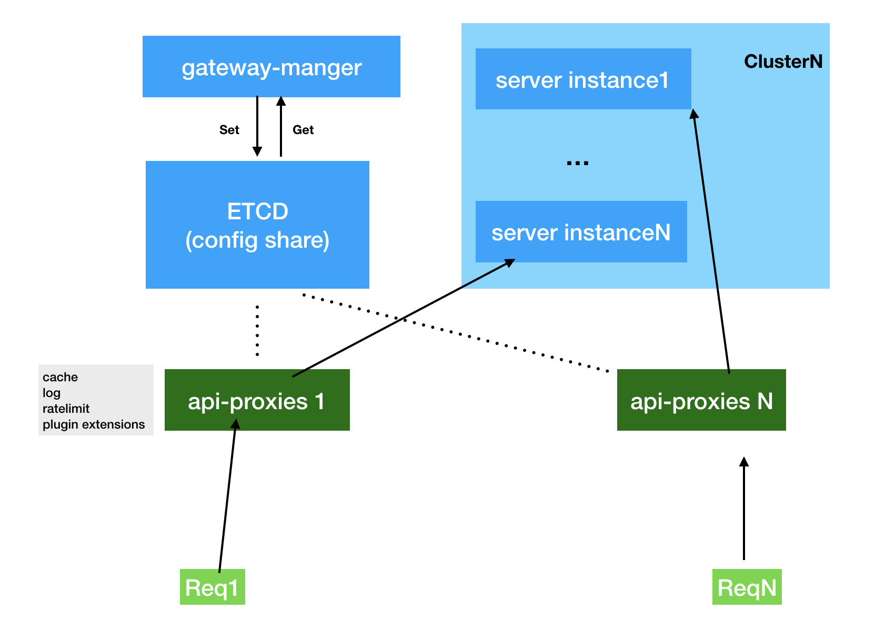

# documents
documents of jademperor and projects

## [API Gateway project](./projects/API-GATEWAY.md)

it contains projects: 

* [api-proxier](https://github.com/jademperor/api-proxier) a proxier to reverse http request to server instance and provide `cache`, `ratelimit`, `httplog` plugins etc.
* [gateway-manager](https://github.com/jademperor/gateway-manager) provide `HTTP API` to manage config data and watch server instance `health check`.
* [adminn-vue](https://github.com/jademperor/admin-vue) admin views based `gateway-manager`.
* [common](https://github.com/jademperor/common) project common `library` based `go`.

this project's architecture as following:

